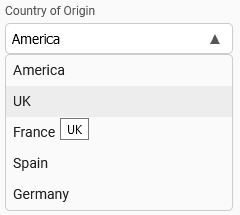

# select

A vanilla JS select UI component.



## Usage

`npm i @samhuk/select`

```typescript
import { createSelect } from '@samhuk/select'

const element = document.createElement('div')

const select = createSelect({
  initialValue: 'America',
  initialOptionDataList: [
    { uuid: '1', value: 'america', displayName: 'America' },
    { uuid: '2', value: 'united-kingdom', displayName: 'UK' },
    { uuid: '3', value: 'france', displayName: 'France' },
    { uuid: '4', value: 'spain', displayName: 'Spain' },
    { uuid: '5', value: 'germany', displayName: 'Germany' }
  ],
  unavailableValueHandling: UnavailableValueHandling.ALLOW,
  label: 'Country of Origin',
})

element.appendChild(select.rendered.element)
```

### Importing Styles

There are two main ways the styles of the component can be imported into another project. One can either:

1. `import` the scss entrypoint or css bundle file into your .ts or .js file. This is supported by all the main bundlers out there like webpack and esbuild as long as you have the required loader/plugin for scss or css files configured.
  ```typescript
  // Import the scss entrypoint file from the src
  import 'node_modules/@samhuk/select/src/component/styles/index.scss'
  // Import the css bundle file
  import 'node_modules/@samhuk/select/dist/styles.css'
  ```
2. `@import` the scss entrypoint file into your scss file.
  ```scss
  @import '~@samhuk/select/src/component/styles/index.scss';
  ```
